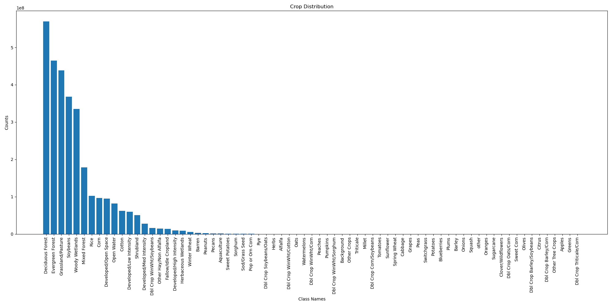
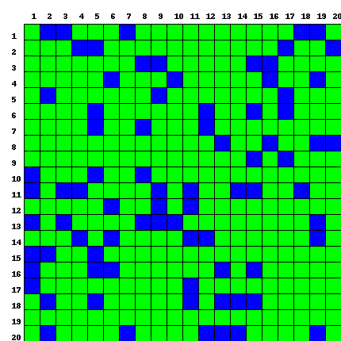
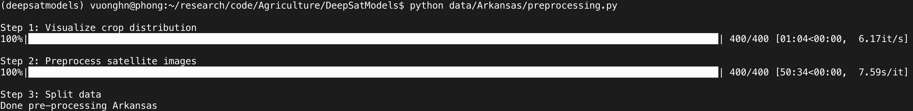

# Crop type segmentation

## Environment Setup

1. **Creating the Environment**: Navigate to the code directory in your terminal and create the environment using the provided `.yml` file by executing:

        conda env create -f deepsatmodels_env.yml

2. **Activating the Environment**: Activate the newly created environment with:

        source activate deepsatmodels

3. **PyTorch Installation**: Install the required version of PyTorch along with torchvision and torchaudio by running:

        conda install pytorch torchvision torchaudio cudatoolkit=10.1 -c pytorch-nightly
## Download data
`python /data/Arkansas/Download.py`

## Preprocessing data
Please check file `data/Arkansas/preprocessing.py`. 
```
cd data/Arkansas/
python preprocessing.py
```

### Config

**Config path:** Please set the config path for `satellite_image_dir` and `output_dir`. The output data after running preprocessing will be stored at `output_dir`

```
satellite_image_dir = "/data/datasets/satellite/raw_arkansas_2023/2023_all"
output_dir = "/data/datasets/satellite/AR23_processed"
```

**Config class ID:**  Please make sure that the file `configs/Arkansas/cdl.yaml` is available. This is the correctponsding the class_ID and the name of class (crop type)

```
num2class:
  0 : "Background"
  ... 
  ...
  ...
  254 : "Dbl Crop Barley/Soybeans"
```

**Config the specipice bands and number image per moths:** Please make sure that the file `configs/Arkansas/arkansas_data.yaml` is available. 

```
sample_requirements:
  1: 1  # January
  2: 1  # February
  3: 1  # March
  4: 2  # April
  5: 2  # May
  6: 2  # June
  7: 2  # July
  8: 2  # August
  9: 2  # September
  10: 1 # October
  11: 1 # November
  12: 1  # December

bands:
    "10m": ["B2", "B3", "B4", "B8"] # 10m resolution
    "20m": ["B5", "B6", "B7", "B8A", "B11", "B12"] # 20m resolution
    "SCL": ["SCL"] # 20m resolution
```


The data structure for `satellite_image_dir` looks like that:

```
├── 0_0
    ├── 2023-01-03
        ├── 10m_rgb_2023-01-03.tif
        ├── B11_2023-01-03.tif
        ├── B12_2023-01-03.tif
        ├── B2_2023-01-03.tif
        ├── B3_2023-01-03.tif
        ├── B4_2023-01-03.tif
        ├── B5_2023-01-03.tif
        ├── B6_2023-01-03.tif
        ├── B7_2023-01-03.tif
        ├── B8_2023-01-03.tif
        ├── B8A_2023-01-03.tif
        ├── SCL_2023-01-03.tif
        ├── TCI_2023-01-03.jpg
        ├── TCI_B_2023-01-03.tif
        ├── TCI_G_2023-01-03.tif
        └── TCI_R_2023-01-03.tif
    ├── ...
    ├── 2023-12-27
    └── cdl.tif
├── 0_1
├── ...
└── 19_19

```

### Visualize

The function `visual_crop_distribution` will be used for the feature Visualize crop distribution. After calling this function, it will visualize crop distribution.

* `visual_crop_distribution(satellite_image_dir, output_dir)`

### Preprocessing data

The function `preprocess_satellite` processes large data. The input is the `satellite_image_dir` path as structured above. The output will be tiled data saved in a pickle file.


* For each pickle file, the format is:
    ```
    pickle_data = {
        'img': series_image, 
        'doy': doys,
        'labels': np.array(labels, dtype=np.uint8),
    }
    ```
* The API looks like `preprocess_satellite(satellite_image_dir, pickle_dir, num_cpus=8)`. Please change `num_cpus` based on your machine's resources.

### Split data
After run preprocessing data, the processed data will be stored, we need to split to `train/val`, we use random sampling based on the region. The figure bellow show the data for Arkansas region, the blue for validation and the green for training data. 

* Noted: In the future, we can change the way to do sampling data    
    

Here is the log after running visual data and preprocessing data.


The structure output data:

```
├── crop_distribution.png
├── fold-paths
    ├── train_sub_data.csv
    └── val_sub_data.csv
└── pickle24x24
    ├── 0_0
        ├── 984_744.pickle
        ├── ...
        ├── ...
        ├── ...
        └── 984_840.pickle
    ├── 0_1
    ├── ...
    └── 19_19

```
## Training models
### Config
Please check file `/configs/Arkansas/TSViT_AR23_focal.yaml` to set the parameter for training model such as `num_classes`, `batch_size`, `lr`, `save_path`, `etc ..`
* Setup the number of GPUs: 
    * In `/TSViT_AR23_focal.yaml`, change `device_id` by the GPU_ID you would like to train. For example, if you would like to train on the GPU 1, 2, 3, 4. Simplyfy set evice_id: [1,2,3,4]

` python train_and_eval/segmentation_training_transf.py --config configs/Arkansas/TSViT_AR23_focal.yaml`

## Evalution

`python train_and_eval/validation_AR24.py --config configs/Arkansas/TSViT_AR23_infer.yaml`

## Inference and Visualzation

`python train_and_eval/inference_AR24.py`
